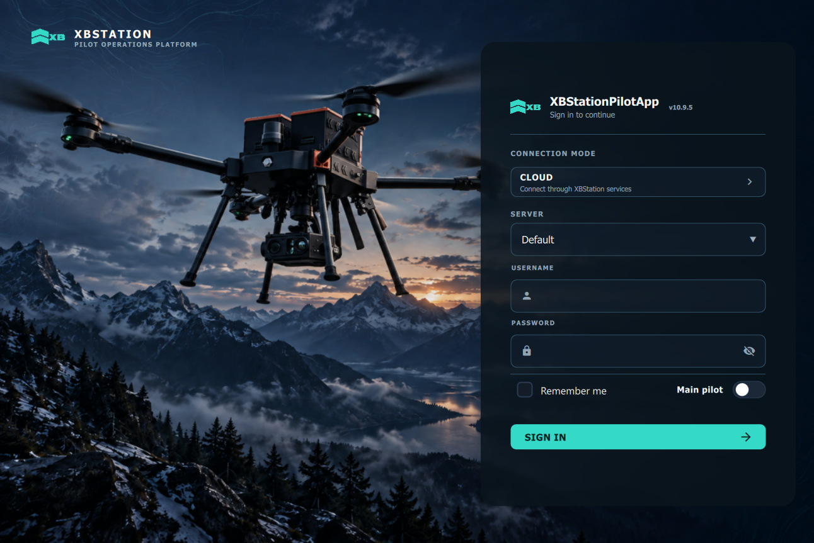

<p align="center">
  
</p>

<h1 align="center">XBStation Pilot App Launcher</h1>

<p align="center">
  The reliable starting point for XBStationPilotApp on Windows.
</p>

<p align="center">
  <a href="https://github.com/xb-uav/pilot-app-launcher/releases/latest"><strong>Download latest release</strong></a>
  ·
  <a href="#what-the-launcher-does">Features</a>
  ·
  <a href="#pilot-app-preview">Preview</a>
  <br>
  <a href="https://xbstation.com/">Website</a>
  ·
  <a href="https://xbstation.com/solution/platform">Platform</a>
  ·
  <a href="https://docs.xbstation.com/">Documentation</a>
  ·
  <a href="https://xbstation.com/about-us">About</a>
  ·
  <a href="https://xbstation.com/contact">Contact</a>
</p>

<p align="center">
  
  
</p>


## About

**XBStation Pilot App Launcher** prepares and opens the correct XBStationPilotApp release for the operator. It provides a consistent entry point for the desktop application while taking care of version files, download progress and startup in the background.

This repository is the official release channel for the public Windows launcher. Installer packages and release notes are available on the [Releases](https://github.com/xb-uav/pilot-app-launcher/releases) page.

## What the launcher does

| | Capability | Experience |
| --- | --- | --- |
| **01** | **Fast startup** | Opens the configured local Pilot App immediately when it is ready. |
| **02** | **Version-aware delivery** | Downloads the required Pilot App release when it is not available locally. |
| **03** | **Reliable fallback** | Starts an installed local version when the update service is temporarily unavailable. |
| **04** | **Clear progress** | Shows download, extraction and launch status in a compact window. |
| **05** | **Background operation** | Continues preparing the app without keeping the main launcher window in the way. |
| **06** | **Startup integration** | Supports optional Windows autostart using the preference shared with the Pilot App. |

## A simple launch experience

1. **Start the launcher** — it checks the Pilot App version and executable selected on the machine.
2. **Prepare the app** — when required, it downloads and extracts the corresponding release package.
3. **Continue to XBStationPilotApp** — the launcher saves the resolved version and opens the application from the correct location.

If a valid local installation is already available, the launcher goes directly to the Pilot App. An internet connection is needed when a release must be downloaded.

## Pilot App preview

The launcher hands off to the XBStationPilotApp login experience once the selected release is ready.



## Get started

1. Open the [latest release](https://github.com/xb-uav/pilot-app-launcher/releases/latest).
2. Download the Windows installer.
3. Run the installer and complete setup.
4. Start **XBStation Pilot App Launcher**.

> The initial Pilot App download requires an internet connection. Access-controlled deployments may also require permission to their corresponding release channel.

## Having trouble?

If the launcher cannot complete startup, check the local activity log at:

```text
%TEMP%\xbstation-launcher.log
```

The log records update checks, downloads, extraction attempts and the final application path, which helps the support team identify the failure quickly.

---

<p align="center">
  Part of the <a href="https://xbstation.com">XBStation Pilot Operations Platform</a>.
</p>
